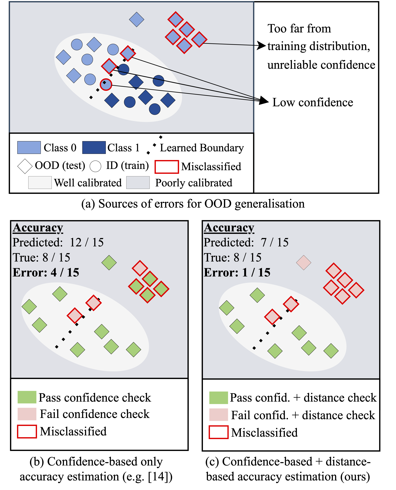

# [Distance matters for improving performance estimation under covariate shift](tbd)
[Mélanie Roschewitz](melanibe.github.io) & [Ben Glocker](http://wp.doc.ic.ac.uk/bglocker/).  
Accepted at [ICCV - Workshop on Uncertainty Estimation 2023](https://uncv2023.github.io/).

**Abstract**
Performance estimation under covariate shift is a crucial component of safe AI model deployment, especially for sensitive use-cases. Recently, several solutions were proposed to tackle this problem, most leveraging model predictions or softmax confidence to derive accuracy estimates. However, under dataset shifts confidence scores may become ill-calibrated if samples are too far from the training distribution. In this work, we show that taking into account distances of test samples to their expected training distribution can significantly improve performance estimation under covariate shift. Precisely, we introduce a "distance-check" to flag samples that lie too far from the expected distribution, to avoid relying on their untrustworthy model outputs in the accuracy estimation step. We demonstrate the effectiveness of this method on 13 image classification tasks, across a wide-range of natural and synthetic distribution shifts and hundreds of models.

This repository contains all the necessary code to reproduce our model evaluation, training and plots. Paper can be found [here](tbd).

## Overview
The repository is divided into the following sub-folders:

* [evaluation](evaluation/) contains the most important part of this codebase, defining all necessary tools for accuracy estimation. In particular:
    * [evaluation_confidence_based.py](evaluation/evaluation_confidence_based.py) main entry point for running our experiments and reproduce the results in Table 1 (see example below).
    * [plotting_notebook.ipynb](evaluation/plotting_notebook.ipynb) contains all plotting code and evaluation code to fill in the results tables.
    * [evaluation_gde_based.py](evaluation/evaluation_gde_based.py) to reproduce the GDE versus GDE-DistCS experiments.
    * [distance_checker.py](evaluation/distance_checker.py) main file building our proposed distance checker.
    * [confidence_estimates.py](evaluation/confidence_estimates.py) main file defining ATC, DoC baselines including code for temperature scaling (both global and class-wise).
    * [inference_utils.py](evaluation/inference_utils.py) all functions necessary to gather model outputs
    * [tsne_analysis.ipynb](evaluation/tsne_analysis.ipynb) to reproduce our TSNE plot (Fig. 2)
    * In the [ablation_studies](evaluation/ablation_studies/) folder, you will find the script to run our ablations on K-NN hyperparameters and threshold choices.

* [classification](classification/) contains all the necessary code to train and define models, as well as all the code to load specific experimental configurations. The `configs/general` subfolder contains all training configuration used in this work. Our code is uses [PyTorch Lightning](https://pytorch-lightning.readthedocs.io/en/latest/starter/introduction_guide.html) and the main classification module is defined in [classification_module.py](classification/classification_module.py). The main entry point for training models is [train_all_models_for_dataset.py](classification/train_all_models_for_dataset.py) to train all models used in the paper for a given task. All the outputs will be placed in `[REPO_ROOT] / outputs` by default. 
* [data_handling](data_handling/) contains all the code related to data loading and augmentations. 

## Prerequisites
1. Start by cloning our conda environment as specified by the [environment_full.yml](environment_full.yml) file as the root of the repository. 
2. Make sure you update the paths to your datasets in [default_paths.py](default_paths.py).
3. Make sure the root directory is in your `PYTHONPATH` environment variable. 

Ready to go!

## Step-by-step example
In this section, we will walk you through all steps necessary to reproduce the experiments for Living17. The procedure is identical for all other experiments, you just need to change which dataset you want to use. 

Assuming your current work directory is the root of the repository:
1. Train all models (this will take a few days!) for this dataset `python classification/train_all_models_for_dataset.py --dataset living17`. 
5. You are ready to run the evaluation benchmark with `python evaluation/evaluation_confidence_based.py --dataset living17`
6. The outputs can be found in the `outputs/{DATASET_NAME}/{MODEL_NAME}/{RUN_NAME}` folder. There you will find `metrics.csv` which contains all predictions and errors for all models for this dataset.
7. If you then want to reproduce the plots and the aggregated results over all models as in Table 1 in paper, you will need run the `evaluation/plotting_notebook.ipynb` notebook. 
